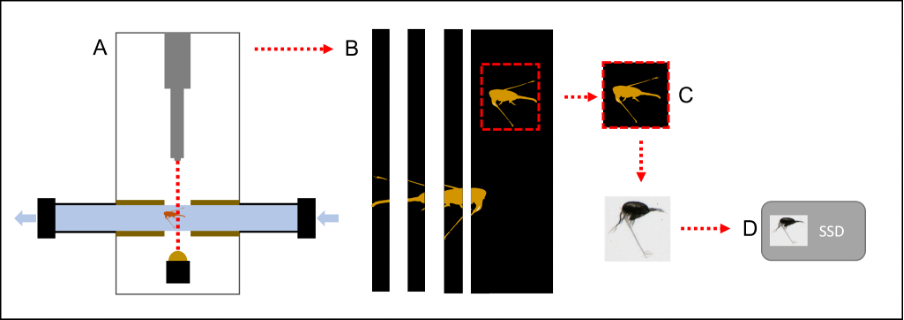

# Rapid identification of plankton using Machine Learning

## Background
Plankton plays an essential role in the global carbon cycle and carbon sequestration, regulating the exchange of carbon dioxide between the atmosphere, surface ocean and ultimately the seabed. In particular, the role of zooplankton in the food web is critical as they occupy a central position, often controlling the abundance of smaller organisms by grazing and providing food for many larval and adult fish and seabirds. Plankton is also used in global monitoring efforts providing reliable and sensitive indicators to climate change and ecosystem health. 

Cefas (The Centre for Environment, Fisheries, and Aquaculture Science) is an agency of Defra (the Government’s Department of Environment, Food and Rural Affairs) and world leading experts in marine and freshwater science. Research at Cefas aims to tackle the serious global problems of climate change, marine litter, overfishing, and pollution to secure a sustainable future for marine ecosystems.

The RV Cefas Endeavour, a multi-disciplinary research vessel, collects millions of plankton images during its surveys through the Plankton Imager system: a high-speed imaging instrument which continuously pumps water, takes images of the passing particles, and attempts to identifies the zooplankton organisms present (**Figure 1**). Images have varying shapes and sizes with a highly-skewed distribution towards smaller particles/images. Of these, over 80% can be classified as detritus (e.g., sand, seaweed fragments, microplastics) which are traditionally removed by-eye before any analysis, leaving the remaining plankton images to be manually labelled.

**Figure 1** RV Cefas Endeavour Plankton Imager pipeline. Water flows through perpendicular to a line-scan camera (A). Scan lines are stitched (B) and regions of interest are extracted (C). Images are converted from RGB and stored on external storage (D). 

## The Challenge
The challenge here is to develop rapid on-the-fly machine learning methods to automatically classify individual plankton species (using information on their shape, features and size) and also discern them from detritus. Off-the-shelf machine learning-based automated image classification methods usually require input images to be uniform in shape, while the images collected by the Plankton Imager vary in shape and size, presenting a challenge. 

To get participants started in addressing this challenge, they will have the opportunity to explore the dataset using a tool being openly developed at the Turing: [scivision](https://github.com/alan-turing-institute/scivision), which aims to provide a bridge between scientific imaging data and computer vision algorithms.

**Scivision** facilitates the handling and loading of the images in the dataset, and provides a model wrapper to efficiently switch between these during the experimentation phase.

## The Data
The data for this challenge consists of 40,000 labelled images of individual plankton collected on the RV Cefas Endeavour using the Plankton Imager system. The data contains images of around 20 different species, however the number of images per species varies greatly, ranging from 4000 images to 10 images per species. Challenge participants will have to decide how to address this imbalance in order to produce a model that provides useful and accurate classifications of plankton. Participants will have the opportunity to explore classifying the images at different taxonomic levels (see **Figure 2**) in order to address this challenge.

For this challenge 5000 images of detritus will also be provided. These images are of other objects collected by the RV Cefas Endeavour Plankton Imager system such as sand, seaweed, or microplastics. Manual removal of these images is a significant bottleneck in the analysis of imagery collected using this sensor. Challenge participants therefore also have the opportunity to explore automated sorting of images into plankton and detritus in order to improve the efficiency and accuracy of plankton classification as a stretch goal. 

**Figure 2** Left, Major and minor categories with their number and percentage of the total images. Right upper, class distribution of the observed categories. Right bottom, samples of other image types (non-relevant) of the plankton challenge dataset. The figure is only for illustrative purposes.

## Goals
- The main goal is to find an automated and rapid method that balances between classifying plankton at finer taxonomic resolution (i.e., not just identifying species but also sub-species) and accuracy.
- A further goal would be to recognise and classify the different species in a dataset that contains detritus.

## Suggested approaches
- Participants can use the scivision tool to load and explore the challenge dataset
- The challenge involves full-colour (RGB) image data with different sizes, orientations, occasionally out of focus, so computer vision techniques capable of extracting efficient context attributes such as U-Net or other types of Convolutional Neural Networks would be valuable. 
- The data imbalance is a natural problem of the surveys from the Plankton Imager system, so techniques to handle it before, during or after predictive modelling will be welcome.

## Impact
Through developing automated tools for plankton classification the challenge participants will contribute to improving the accuracy and efficiency of a key process for monitoring a critical component of marine ecosystems, thus contributing to our understanding of the impact of climate change and other anthropogenic effects on marine ecosystem health. Additionally, development of methods to sort plankton from detritus will help make these automated methods more practical, allowing them to be applied directly to imagery from sensing platforms such as the RV Cefas Endeavour Plankton Imager system. Participants will also provide valuable feedback for the ongoing development of a tool for aiding analysis of imagery across diverse scientific domains.

## TODO

- Add detail on the classification tasks
- Assessment criteria
- Make sure the data section is consistent with the dataset and data dictionary/README
- Suggested approaches
- Suggest additional features for training (incl time, GPS coordinates)
- References
